# MUKUT Smart Coal Miner Helmet

**Underground Safety Intelligence Platform**

> Protecting every miner in real time through LoRa Mesh communication, hazard detection, and live telemetry monitoring. Built for environments where GPS and internet do not exist.


---

## Hardware Gallery

| MUKUT System Overview | Node Close-up |
| :---

## Dashboard Gallery

| Analytics | Signal Panel |
| :---: | :---: |
| 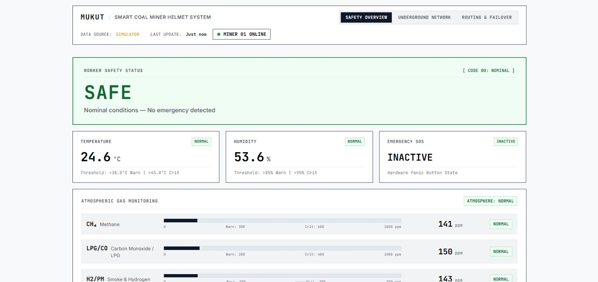 | 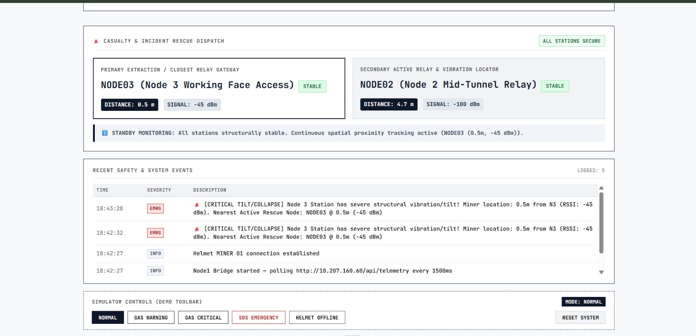 |
| 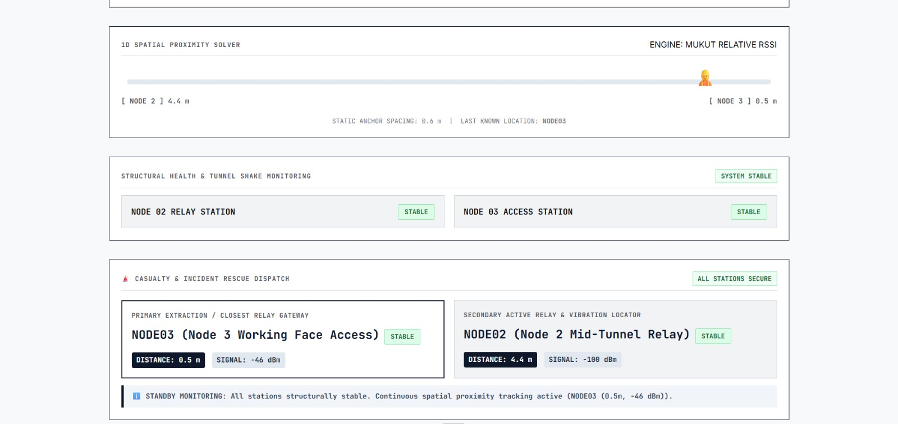 | 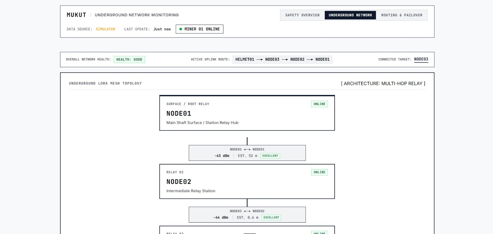 |
| 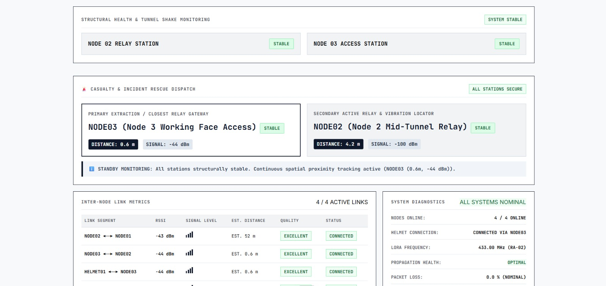 | 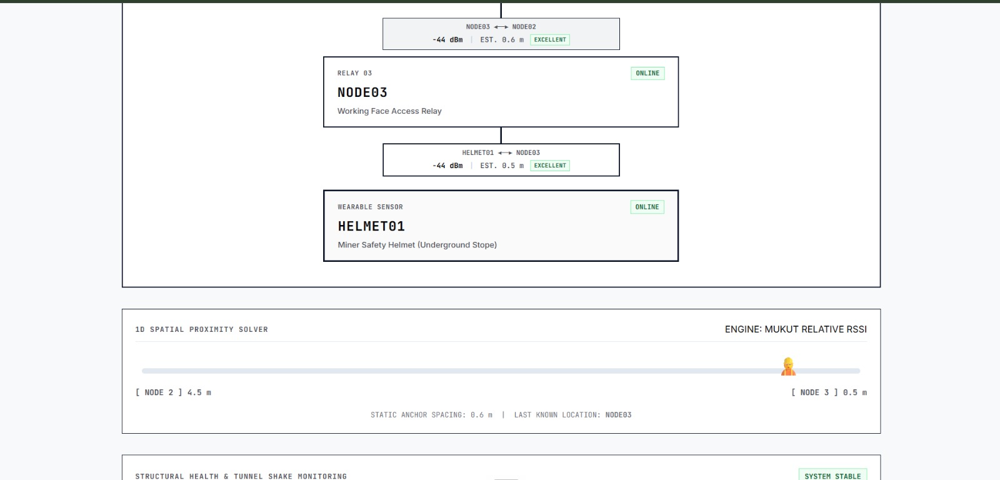 |

---
: | :---: |
| 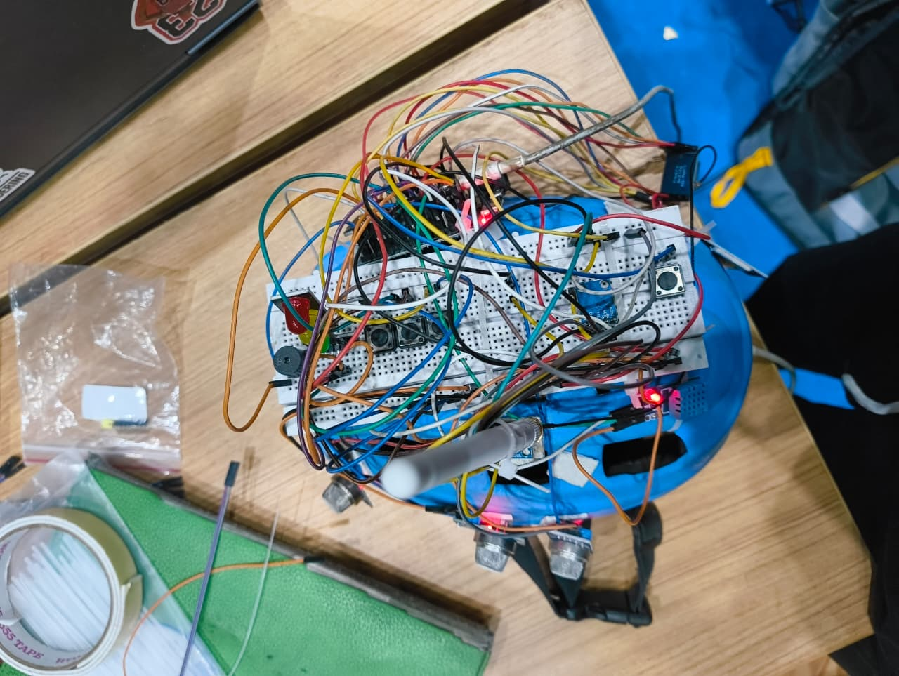 | 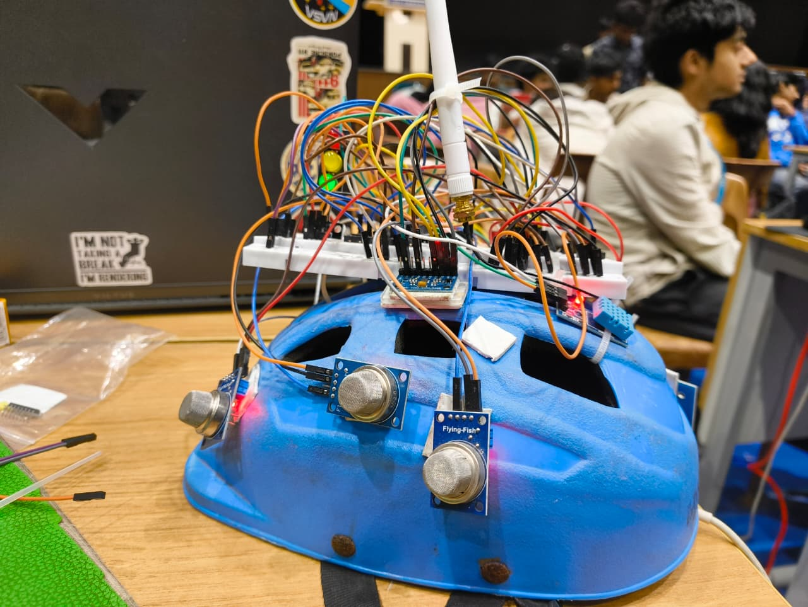 |
| 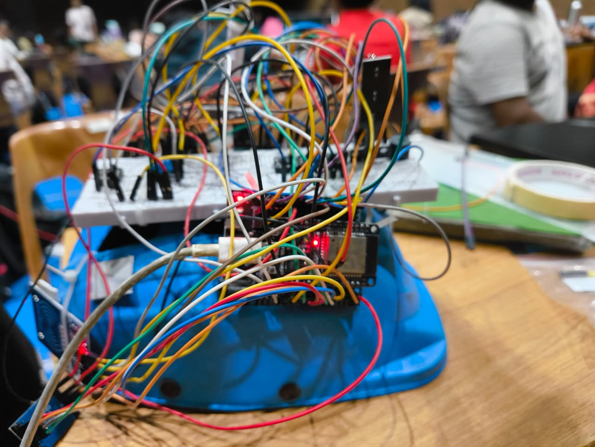 | 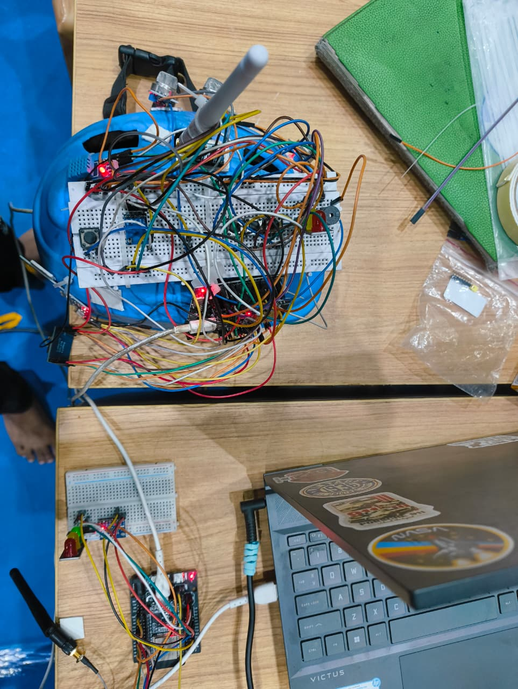 |

---

## What Is MUKUT?

MUKUT Smart Coal Miner Helmet is an intelligent IoT-based wearable safety platform for underground coal mines where GPS and internet are completely unavailable.

| Capability | Description |
|:---|:---|
| Smart Helmet Node | ESP32 + LoRa + 7 sensors: gas, temperature, humidity, motion, compass, SOS |
| LoRa Mesh Network | Underground relay nodes extend coverage through tunnels without cables |
| Surface Gateway | ESP-NOW to Wi-Fi bridge — receives relay data and POSTs to backend |
| Live Dashboard | React app with Socket.IO — real-time RSSI, distances, sensor alerts |
| Emergency Alerting | SOS activation, gas threshold breach, and offline detection |
| Dead-Reckoning | IMU + compass based position estimation without GPS |

---

## Problem Statement

```
  Underground Mine Safety Crisis:
  - 400+ coal mining deaths in India annually
  - GPS signal completely unavailable underground
  - Standard Wi-Fi penetrates only 30m through rock
  - Gas leaks (Methane/LPG/H2) are the number 1 cause of explosions
  - Manual check-ins delay emergency response by 10 to 40 minutes
  - No real-time position awareness for surface supervisors
```

---

## System Architecture

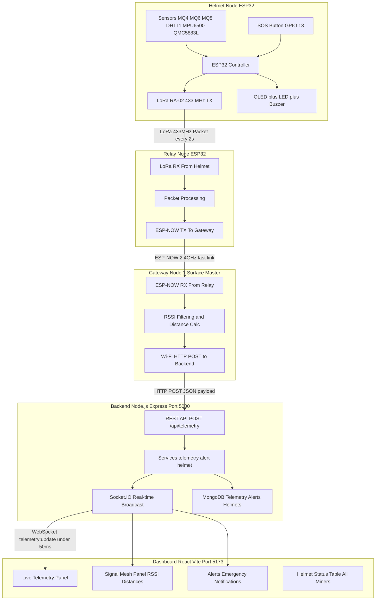
```mermaid
graph TB
    subgraph HELMET["Helmet Node ESP32"]
        HS["Sensors MQ4 MQ6 MQ8 DHT11 MPU6500 QMC5883L"]
        HC["ESP32 Controller"]
        HL["LoRa RA-02 433 MHz TX"]
        HO["OLED plus LED plus Buzzer"]
        HSOS["SOS Button GPIO 13"]
        HS --> HC
        HC --> HL
        HC --> HO
        HSOS --> HC
    end

    subgraph RELAY["Relay Node ESP32"]
        RL_RX["LoRa RX From Helmet"]
        RL_PROC["Packet Processing"]
        RL_TX["ESP-NOW TX To Gateway"]
        RL_RX --> RL_PROC --> RL_TX
    end

    subgraph GATEWAY["Gateway Node 1 Surface Master"]
        GW_RX["ESP-NOW RX From Relay"]
        GW_PROC["RSSI Filtering and Distance Calc"]
        GW_WIFI["Wi-Fi HTTP POST to Backend"]
        GW_RX --> GW_PROC --> GW_WIFI
    end

    subgraph BACKEND["Backend Node.js Express Port 5000"]
        BE_API["REST API POST /api/telemetry"]
        BE_SVC["Services telemetry alert helmet"]
        BE_SOCK["Socket.IO Real-time Broadcast"]
        BE_DB["MongoDB Telemetry Alerts Helmets"]
        BE_API --> BE_SVC --> BE_DB
        BE_SVC --> BE_SOCK
    end

    subgraph DASHBOARD["Dashboard React Vite Port 5173"]
        DA_LIVE["Live Telemetry Panel"]
        DA_SIG["Signal Mesh Panel RSSI Distances"]
        DA_ALERT["Alerts Emergency Notifications"]
        DA_TABLE["Helmet Status Table All Miners"]
    end

    HL -- "LoRa 433MHz Packet every 2s" --> RL_RX
    RL_TX -- "ESP-NOW 2.4GHz fast link" --> GW_RX
    GW_WIFI -- "HTTP POST JSON payload" --> BE_API
    BE_SOCK -- "WebSocket telemetry:update under 50ms" --> DA_LIVE
    BE_SOCK --> DA_SIG
    BE_SOCK --> DA_ALERT
```

---

## LoRa Mesh Network Topology

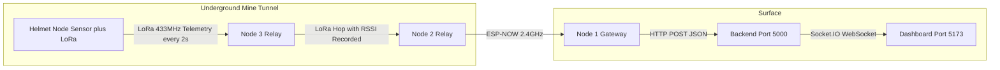
```mermaid
graph LR
    subgraph UNDERGROUND["Underground Mine Tunnel"]
        MINER["Helmet Node Sensor plus LoRa"]
        NODE3["Node 3 Relay"]
        NODE2["Node 2 Relay"]
    end

    subgraph SURFACE["Surface"]
        NODE1["Node 1 Gateway"]
        LAPTOP["Backend Port 5000"]
        BROWSER["Dashboard Port 5173"]
    end

    MINER -- "LoRa 433MHz Telemetry every 2s" --> NODE3
    NODE3 -- "LoRa Hop with RSSI Recorded" --> NODE2
    NODE2 -- "ESP-NOW 2.4GHz" --> NODE1
    NODE1 -- "HTTP POST JSON" --> LAPTOP
    LAPTOP -- "Socket.IO WebSocket" --> BROWSER
```

---

## Existing Solutions vs MUKUT

| Feature | Existing Systems | MUKUT |
|:---|:---|:---|
| Underground Range | 100 to 300m with expensive cables | 500m+ wireless LoRa |
| Infrastructure Cost | 50000 to 500000 USD | Under 100 USD per node |
| Gas Detection | Manual or fixed point only | Wearable continuous monitoring |
| Real-time Position | None available | IMU dead-reckoning estimate |
| Emergency Alert Time | 10 to 40 minutes | Under 3 seconds |
| Mesh Redundancy | None | Multi-hop relay network |
| Setup Time | Weeks of installation | Hours |
| Power | Mains power required | Battery operated portable |

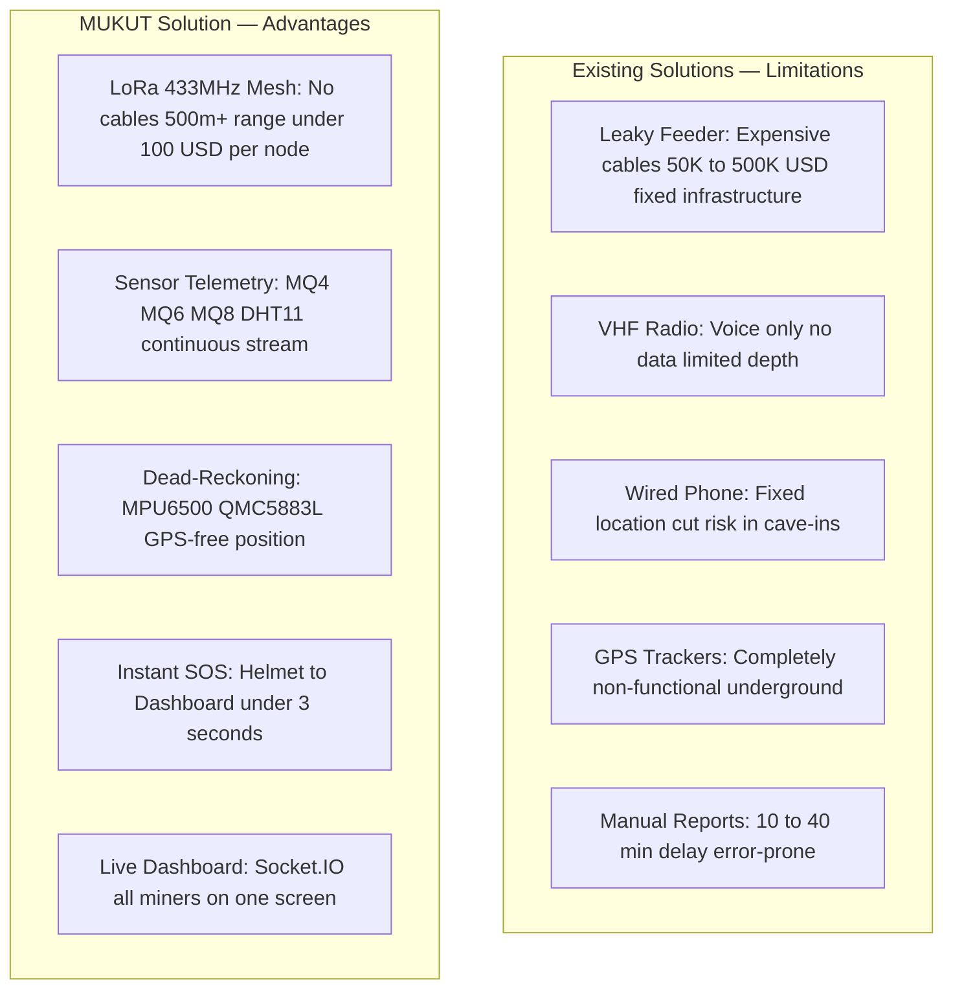
```mermaid
graph TB
    subgraph OLD["Existing Solutions — Limitations"]
        E1["Leaky Feeder: Expensive cables 50K to 500K USD fixed infrastructure"]
        E2["VHF Radio: Voice only no data limited depth"]
        E3["Wired Phone: Fixed location cut risk in cave-ins"]
        E4["GPS Trackers: Completely non-functional underground"]
        E5["Manual Reports: 10 to 40 min delay error-prone"]
    end

    subgraph NEW["MUKUT Solution — Advantages"]
        M1["LoRa 433MHz Mesh: No cables 500m+ range under 100 USD per node"]
        M2["Sensor Telemetry: MQ4 MQ6 MQ8 DHT11 continuous stream"]
        M3["Dead-Reckoning: MPU6500 QMC5883L GPS-free position"]
        M4["Instant SOS: Helmet to Dashboard under 3 seconds"]
        M5["Live Dashboard: Socket.IO all miners on one screen"]
    end
```

---

## RSSI Signal Processing Pipeline

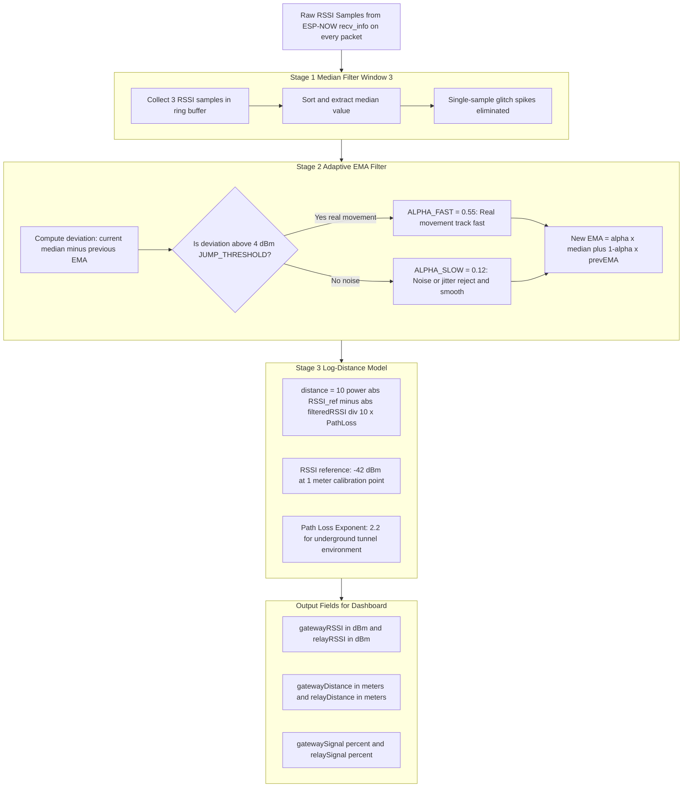
```mermaid
flowchart TD
    RAW["Raw RSSI Samples from ESP-NOW recv_info on every packet"]

    subgraph MEDIAN["Stage 1 Median Filter Window 3"]
        M1["Collect 3 RSSI samples in ring buffer"]
        M2["Sort and extract median value"]
        M3["Single-sample glitch spikes eliminated"]
        M1 --> M2 --> M3
    end

    subgraph EMA["Stage 2 Adaptive EMA Filter"]
        E1["Compute deviation: current median minus previous EMA"]
        E2{"Is deviation above 4 dBm JUMP_THRESHOLD?"}
        E3["ALPHA_FAST = 0.55: Real movement track fast"]
        E4["ALPHA_SLOW = 0.12: Noise or jitter reject and smooth"]
        E5["New EMA = alpha x median plus 1-alpha x prevEMA"]
        E1 --> E2
        E2 -->|Yes real movement| E3 --> E5
        E2 -->|No noise| E4 --> E5
    end

    subgraph DIST["Stage 3 Log-Distance Model"]
        D1["distance = 10 power abs RSSI_ref minus abs filteredRSSI div 10 x PathLoss"]
        D2["RSSI reference: -42 dBm at 1 meter calibration point"]
        D3["Path Loss Exponent: 2.2 for underground tunnel environment"]
    end

    subgraph OUT["Output Fields for Dashboard"]
        O1["gatewayRSSI in dBm and relayRSSI in dBm"]
        O2["gatewayDistance in meters and relayDistance in meters"]
        O3["gatewaySignal percent and relaySignal percent"]
    end

    RAW --> MEDIAN --> EMA --> DIST --> OUT
```

---

## End-to-End Telemetry Data Flow

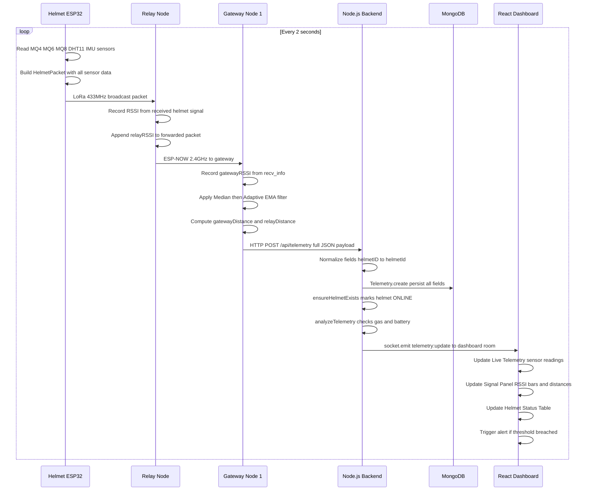
```mermaid
sequenceDiagram
    participant H as Helmet ESP32
    participant R as Relay Node
    participant G as Gateway Node 1
    participant B as Node.js Backend
    participant S as MongoDB
    participant D as React Dashboard

    loop Every 2 seconds
        H->>H: Read MQ4 MQ6 MQ8 DHT11 IMU sensors
        H->>H: Build HelmetPacket with all sensor data
        H->>R: LoRa 433MHz broadcast packet

        R->>R: Record RSSI from received helmet signal
        R->>R: Append relayRSSI to forwarded packet
        R->>G: ESP-NOW 2.4GHz to gateway

        G->>G: Record gatewayRSSI from recv_info
        G->>G: Apply Median then Adaptive EMA filter
        G->>G: Compute gatewayDistance and relayDistance
        G->>B: HTTP POST /api/telemetry full JSON payload

        B->>B: Normalize fields helmetID to helmetId
        B->>S: Telemetry.create persist all fields
        B->>B: ensureHelmetExists marks helmet ONLINE
        B->>B: analyzeTelemetry checks gas and battery
        B->>D: socket.emit telemetry:update to dashboard room

        D->>D: Update Live Telemetry sensor readings
        D->>D: Update Signal Panel RSSI bars and distances
        D->>D: Update Helmet Status Table
        D->>D: Trigger alert if threshold breached
    end
```

---

## Emergency SOS Workflow

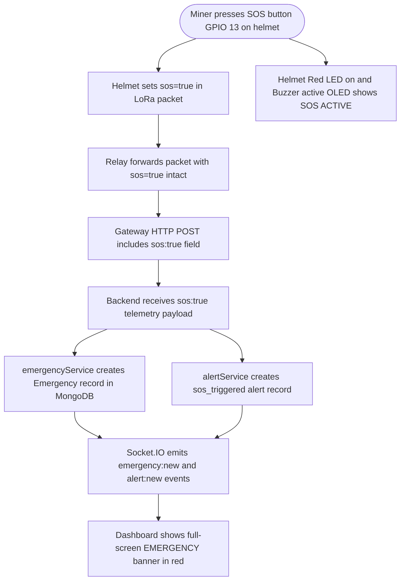
```mermaid
flowchart TD
    SOS_BTN(["Miner presses SOS button GPIO 13 on helmet"])
    PACKET["Helmet sets sos=true in LoRa packet"]
    RELAY["Relay forwards packet with sos=true intact"]
    GATEWAY["Gateway HTTP POST includes sos:true field"]
    BACKEND["Backend receives sos:true telemetry payload"]
    EMER["emergencyService creates Emergency record in MongoDB"]
    ALERT_CREATE["alertService creates sos_triggered alert record"]
    SOCKET_EMIT["Socket.IO emits emergency:new and alert:new events"]
    DASHBOARD_ALERT["Dashboard shows full-screen EMERGENCY banner in red"]
    OFFLINE_BUZZER["Helmet Red LED on and Buzzer active OLED shows SOS ACTIVE"]

    SOS_BTN --> PACKET --> RELAY --> GATEWAY --> BACKEND
    BACKEND --> EMER
    BACKEND --> ALERT_CREATE
    EMER --> SOCKET_EMIT
    ALERT_CREATE --> SOCKET_EMIT
    SOCKET_EMIT --> DASHBOARD_ALERT
    SOS_BTN --> OFFLINE_BUZZER
```

---

## Backend Alert and Offline Monitor Pipeline

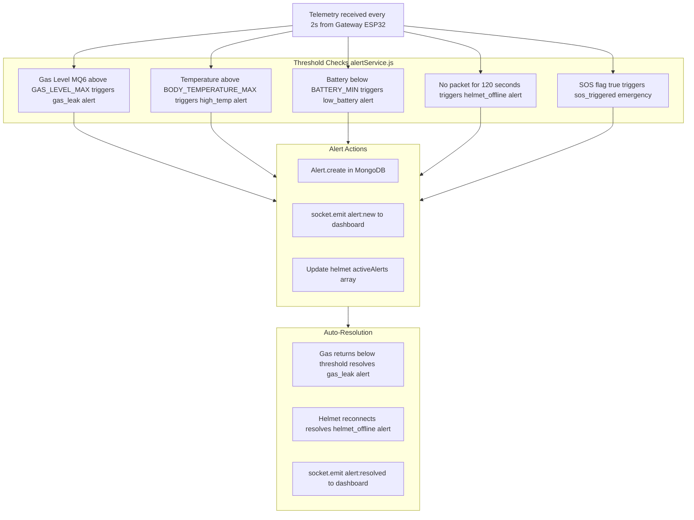
```mermaid
flowchart TD
    TELEM["Telemetry received every 2s from Gateway ESP32"]

    subgraph CHECKS["Threshold Checks alertService.js"]
        G1["Gas Level MQ6 above GAS_LEVEL_MAX triggers gas_leak alert"]
        G2["Temperature above BODY_TEMPERATURE_MAX triggers high_temp alert"]
        G3["Battery below BATTERY_MIN triggers low_battery alert"]
        G4["No packet for 120 seconds triggers helmet_offline alert"]
        G5["SOS flag true triggers sos_triggered emergency"]
    end

    subgraph ACTIONS["Alert Actions"]
        A1["Alert.create in MongoDB"]
        A2["socket.emit alert:new to dashboard"]
        A3["Update helmet activeAlerts array"]
    end

    subgraph RESOLVE["Auto-Resolution"]
        R1["Gas returns below threshold resolves gas_leak alert"]
        R2["Helmet reconnects resolves helmet_offline alert"]
        R3["socket.emit alert:resolved to dashboard"]
    end

    TELEM --> G1 & G2 & G3 & G4 & G5
    G1 & G2 & G3 & G4 & G5 --> ACTIONS
    ACTIONS --> RESOLVE
```

---

## Hardware Specification

| Component | Model | Interface | GPIO | Role |
|:---|:---|:---|:---|:---|
| MCU | ESP32 WROOM-32 | — | — | Helmet controller |
| LoRa Radio | RA-02 SX1278 | SPI | SCK=18 MISO=19 MOSI=23 NSS=16 | 433MHz mesh |
| Gas Methane | MQ4 | ADC | 35 | CH4 detection |
| Gas LPG | MQ6 | ADC | 34 | LPG detection |
| Gas Hydrogen | MQ8 | ADC | 36 | H2 detection |
| Temp Humidity | DHT11 | Digital | 4 | Environment monitoring |
| IMU | MPU6500 | I2C | — | Accelerometer and Gyroscope |
| Compass | QMC5883L | I2C | — | Heading and direction |
| RFID | RC522 | SPI | — | Worker authentication |
| OLED Display | SH1106 128x64 | I2C | — | Helmet status display |
| LED Alert | Traffic LED Module | Digital | 25 26 27 | Visual hazard indicator |
| Buzzer | Active Buzzer | Digital | 32 | Audible alert sound |
| SOS Button | Momentary Push | Digital | 13 | Emergency activation |

### LoRa RA-02 Wiring

```
RA-02 VCC   -> 3.3V
RA-02 GND   -> GND
RA-02 SCK   -> GPIO 18
RA-02 MISO  -> GPIO 19
RA-02 MOSI  -> GPIO 23
RA-02 NSS   -> GPIO 16
RA-02 RESET -> GPIO 17
RA-02 DIO0  -> GPIO 26
```

---

## Tech Stack

| Layer | Technology | Purpose |
|:---|:---|:---|
| Frontend | React 18 plus Vite | Dashboard UI framework |
| Real-Time | Socket.IO Client 4.x | Live telemetry updates |
| Backend | Node.js plus Express 20.x | REST API server |
| WebSockets | Socket.IO Server 4.x | Push updates to dashboard |
| Database | MongoDB 7.x | Telemetry alerts storage |
| ODM | Mongoose 8.x | MongoDB schema management |
| Logging | Pino 10.x | Structured JSON logs |

---

## API Reference

| Method | Endpoint | Description |
|:---:|:---|:---|
| POST | /api/telemetry | Receive telemetry from Gateway ESP32 |
| GET | /api/helmets | List all registered helmets |
| POST | /api/helmets | Register a new helmet |
| GET | /api/helmets/:id/telemetry/latest | Latest telemetry for a helmet |
| GET | /api/helmets/:id/telemetry/history | Historical telemetry paginated |
| GET | /api/dashboard/live | All helmets with current telemetry |
| GET | /health | Backend health check |

---

## Project Structure

```text
MUKUT/
|-- README.md
|-- KAVACH_Project_Context.md
|-- Helmetnode/
|   `-- Helmetnode.ino         Sensors LoRa TX OLED SOS
|-- relaynode/
|   `-- relaynode.ino          LoRa RX to ESP-NOW TX
|-- gatewaynode/
|   `-- gatewaynode.ino        ESP-NOW RX to WiFi HTTP POST
|-- backend/
|   |-- server.js              Entry point
|   |-- .env                   Configuration
|   `-- src/
|       |-- controllers/       telemetryController.js helmetController.js
|       |-- services/          telemetryService alertService helmetService node1Poller serialReader
|       |-- models/            Telemetry.js Helmet.js Alert.js
|       `-- events/            telemetry.events.js
`-- frontend/
    `-- src/
        |-- context/           SocketContext.jsx
        |-- hooks/             useDashboard.js useAnalytics.js useHelmet.js
        |-- pages/             Dashboard Analytics Helmets HelmetDetails
        `-- components/
            |-- dashboard/     MetricCards HelmetTable LiveTelemetry SignalPanel
            `-- helmet/        SensorGrid.jsx HelmetInfo.jsx
```

---

## Quick Start

### Step 1 — Flash ESP32 Firmware

```cpp
// gatewaynode.ino — update these lines before flashing:
const char* ssid       = "YourWiFiName";
const char* password   = "YourWiFiPassword";
const char* serverURL  = "http://YOUR_PC_IP:5000/api/telemetry";
const char* helmetRegURL = "http://YOUR_PC_IP:5000/api/helmets";
```

Flash order: Helmetnode.ino then relaynode.ino then gatewaynode.ino

### Step 2 — Backend

```bash
cd backend
npm install
```

Edit backend/.env:

```env
PORT=5000
MONGODB_URI=mongodb://localhost:27017/mukut
DATA_SOURCE=wifi
NODE1_TELEMETRY_URL=http://YOUR_ESP32_IP/api/telemetry
OFFLINE_TIMEOUT_MS=120000
```

```bash
npm run dev
```

### Step 3 — Frontend

```bash
cd frontend
npm install
npm run dev
# Open http://localhost:5173
```

## License
MIT License

---

> **MUKUT Smart Coal Miner Helmet**
>
> Protecting Every Miner. Connecting Every Tunnel. Saving Every Life.
>
> Built with ESP32, LoRa 433MHz, React, Node.js, MongoDB, and Socket.IO.
> When GPS fails and Wi-Fi dies — MUKUT still works.